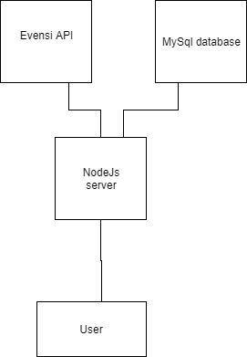

class: middle, center

# Event recommender -- Evensi

---

# Team

- Joni Laurila
- Marja Ahonen

---

# Technology

We did use nodejs server, momentjs library for datetime handling, Evensi API for getting events, mysql database for our data storage.

---
class: center
# Architecture

---

# Solution

1. First we collect information from from Evensi API and analyse it. We search for specific keywords for finding IT events.

2. Then we make recommendations from that data based of number of keywords founded in data.
